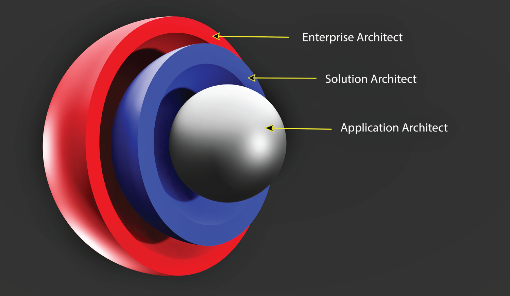
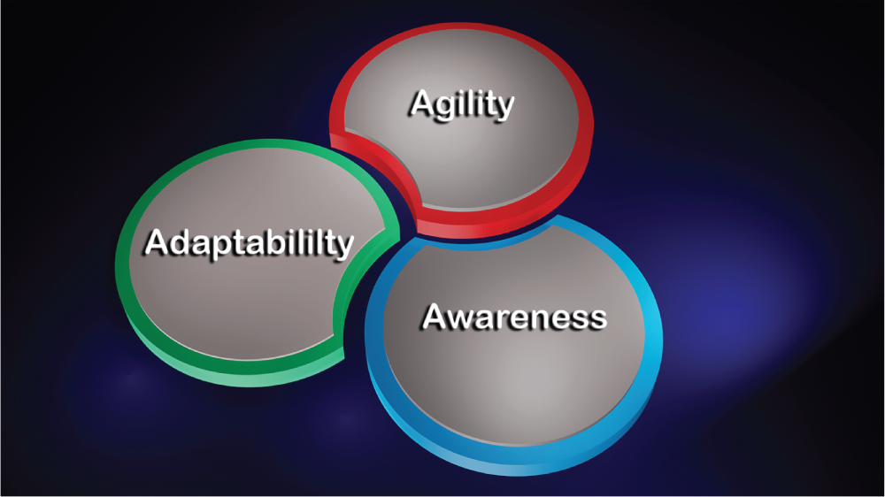

# 简介：软件架构师，你是谁？
作为一名软件架构师，你已经在一个未知且不可预测的领域开始了职业旅程，并且无法保证成功的技术解决方案。 你作为一名软件架构师受雇参与公司业务、技术和社会实验，其主要目的是制造部署到虚拟环境的软件产品。 在计算生态系统中部署和集成软件实施后，预测业务性能质量和稳定性也很困难。

这绝不是软件架构师职业生涯的惨淡写照。 相反，你对企业解决方案贡献的不确定性只会为业务发展和转型机会、技术现代化以及职业提升和成长打开大门。 此外，你的辛勤工作和奉献精神可以通过创造力、想象力和坚持不懈的力量来实现。 一旦你下定决心从事软件架构的职业，或者已经是一名忠实的从业者，你就注定要踏上一段非常成功的旅程。

以下各节描绘了一个理想的软件架构师，其解决组织问题的能力超乎想象。 此配置文件代表了一个全面的软件架构师，具有近乎完美的专业才能，如果存在需要，组织肯定会雇用他。 但是，不要担心或气馁。 我们努力拥有这些概述的品质，通过促进商业文化、战略、使命和愿景来改变人们的生活。

图 I.1 说明了理想的软件架构师的属性：职业导向、先天特质驱动、战略驱动、文化推动者、集成驱动、领导力导向、解决方案驱动、领域驱动和社会驱动。

那么，理想的软件架构师，你是谁？


图 I.1：理想的软件架构师简介

## 你促进制度文化

你被聘为软件架构师来激发变革、激发创新热情、激发新想法、影响组织战略、对抗业务和技术停滞并使人们的生活发生重大变化。

### 成为文化转型的推动者

你将获得一个关键职位来参与将旧的转化为新的。 前者指的是过时的商业理念、传统的经营方式、陈旧的软件产品开发方法以及日渐式微的技术解决方案。 另一方面，"新"涉及现代技术、创造性和实用的应用程序和系统、创新的端到端软件架构方法和生命周期，以及促进组织对话以保护业务的伙伴关系。

通过参与这种雄心勃勃的组织变革，你实际上是文化转型的机构代理人。 你正在积极参与一项影响生活并改变人们行为的社会和技术实验。 这种多方面的文化变革体现在人们如何沟通、与应用程序和系统交互、建立关系和伙伴关系、经营日常生活以及管理他们的职业生涯。

那么，软件架构师如何促进组织文化呢？ 用于对环境产生深远影响的工具和实用程序库非常庞大。 此外，天空是技术进化和创新的极限。 你被要求提供的业务和技术解决方案推动组织政策、最佳实践和标准的建立。 你提倡的这些规则和程序促进了行为的制度规范、培育了商业联盟并建立了新的文化行为准则。

### 贡献，不要跟随

但是，你所推动的文化变革不仅仅涉及个人。 你受雇于利用你的才能和创造力的力量形成新一代的想法，并发现你的组织成员在你的创新愿景的启发下强化了共同的价值观。 事实上，你本质上是一个恩人，而不是一个追随者。 你提供的任何组织解决方案都有助于机构知识库和你的追随者的集体记忆，他们最终被用来解决企业问题。

### 进一步阅读

尽管促进组织文化的话题在整本书中都有讨论，但请参阅这些章节以了解软件架构师可以用来影响组织文化的具体方法：

- 第 3 章，"软件架构师的职业规划：制胜战略"描述了四种可以影响组织文化的职业驱动视角：社会驱动、技术驱动、管理驱动和战略驱动。
- 第 4 章，"软件架构师的自我评估"提供了一份自我评分问卷，其中包含有关促进组织文化方法的问题。

## 你是一个精明的战略家

你的战略思维是你软件架构事业成功的关键。 无论你追求哪个软件架构范围的解决方案，应用程序或企业级别，都要关注大局。 你天生就是个多面手。 永远不要急于研究细节以开发有效的解决方案。 拥有鸟瞰图能让你成为一个全能型的人。

你还是一位才华横溢的战术家，不断思考长期和可持续的解决方案来解决业务问题。 业务繁荣和技术连续性的前景促使你制定复杂的时间表、路线图和产品开发时间表。

无论你的工作有多大，你的战略前景都取决于对实地发生的业务和技术事件的透彻研究。 然后，通过连接各个点，你可以交付卓越的软件架构工件。 在这种情况下，连接点属于聚合和利用所有可能的组织资源，例如主题专家、数据、实用程序和设施，以获得最佳的软件和环境实现。

### 采用有效的由外向内的策略来交付综合软件架构解决方案

你是一名由外而内的软件架构战略家，能够适应市场和行业趋势、组织服务质量，以及最重要的客户需求。 此外，你熟悉先进的产品开发生命周期方法，并经常关注业务市场的发展和创新，这些宝贵的知识可以推动你的方法论满足客户需求。 满足这些要求始于有效的业务发现和分析过程，该过程导致软件架构解决方案。

不要被现有的技术限制所束缚。 如果当前的组织技术倾向于缩小你的愿景范围，你必须推动变革、现代化和与你的软件架构愿景和使命保持一致的举措。 此外，你通过创造力、好奇心和现代性综合推动业务和技术转型。 最后，在提出创新的软件架构实施方案时，永远不要剥夺自己的想象力。

### 使软件架构策略与组织要求保持一致

作为精明的软件架构战略家，你知道你的技术愿景和使命必须与业务战略保持一致。 请记住，你不是在真空中操作。 因此，你的软件架构解决方案应该促进业务议程、促进业务增长并确保业务稳定性和连续性。

然而，使软件架构策略与业务愿景和使命保持一致不会促进令人满意的技术解决方案。 业务合作和协调确实是软件架构师的首要和强制性目标。 然而，他们的职责必须超越业务需要。 有辅助软件架构战略调整的必要性来推动全面的企业技术平衡。

因此，软件架构策略还必须与现有部署环境、支持基础设施、开发平台、数据和消息交换机制、架构风格、设计模式和集成模式保持一致。 同样，如果软件架构策略无法与现有技术和环境保持一致，则促进转型计划以满足软件架构愿景和使命。

图 I.2 说明了软件体系结构战略对齐优先级示例图表，它概述了与业务、技术、环境和基础设施的对齐机会。


图 I.2：软件架构对齐优先级

### 进一步阅读

第 2 章"软件架构师的类型"主要讨论了软件架构战略与业务战略、愿景和使命相一致以推动整个组织的技术计划这一主题。 它介绍了软件架构促进组织转型和现代化的三个业务需求：战略协作、技术中介和技术实施

## 你是一个有天赋的领导者

你是领导者，不一定是经理。 你拥有值得注意的人际关系特征。 你是一个正直的人，会赢得你的同事、经理、公司高管和合作伙伴的信任。 你促进机构社会和谐，以促进对软件架构战略、技术、最佳实践、标准和政策的共识。 你值得信任和值得信赖，因为你对人类有积极的看法。

你天生的领导特质会激励追随者。 这些忠实的粉丝尊重你的观点，并致力于与你就软件架构项目和业务计划进行合作。 作为有天赋的技术领导者和团队合作者，你更喜欢与他人合作。 你通过培养热情的技术人员的集体创造力来鼓励想法和解决方案的多样性。 你从不将自己的观点强加于人——相反，你是一名顾问，一名导师，为那些寻求专业方向的人提供可行的指导。

> 提示 记住，你是领导者。 你不是签署时间表并谴责员工不当行为的经理或行政人员。

### 容忍错误并对技术经验保持开放态度

你天生的问题解决和决策能力描绘了你组织的业务和技术贡献的现实视图。 换句话说，没有什么是完美的！ 你了解任何提议的软件架构解决方案的困难和限制。 并且你了解你的技术建议对你的组织的影响。 明智的做法是，设计不当的应用程序和系统会导致操作混乱、中断业务连续性、对生产力产生负面影响并损害公司的利润。

面对企业面临的所有这些潜在风险，你仍然是一个天生的乐观主义者和理想主义者，一个愿意为了战略性的长期技术成功而放弃短期收益的冒险家。 这些特征定义了一个人可以容忍设计错误、软件实施失误以及软件部署和集成缺陷。 事实上，你并不害怕失败。 在你看来，你愿意踏上的设计实验之旅只会促进成功的技术现代化。

### 通过提升他们的精神来建立一个信任的追随者圈子

作为一名软件架构师，你必须激励他人并在你的同事和工作团队中激发正能量。 你来这里是为了培养创造力——想象力的失败不是一种选择。 你来这里是为了迎来聪明的追随者，他们相信你的软件架构判断力和良好的品味，并且不怕犯设计错误或表达愚蠢的意见。

> 提示 请记住，你是一位实验家，你的领导特质会激发团队协作的热情，从而提供卓越的技术解决方案来维持和加速业务成功。

### 进一步阅读

参加第 4 章"软件架构师自我评估"中提供的自我评估问卷，了解你是否具备合适的软件架构领导人才，能够激发业务创新和技术现代化的热情。

## 你是仪器解决方案提供商

从本质上讲，你是解决方案提供商。 在你的内心深处，有一种隐蔽的愿望是减轻风险、解决社会冲突并提供应对组织挑战的指导。 你总是能及时弥补业务不足。 此外，你会更加努力地寻求务实的技术解决方案。

### 通过现代技术解决方案促进业务增长

你致力于通过技术现代化为可持续和可行的业务增长奠定强有力的战略基础。 你敢于冒险，敢于利用一流的技术能力来支持业务转型。 此外，你认为技术不仅仅是实施临时解决方案或提供经久不衰的创可贴补救措施的机械手段。 简而言之，你是具有技术和战略议程的解决方案提供商，可以容忍偶尔的失败以实现新的目标。

### 在你的软件架构专业知识范围内提供解决方案

作为软件架构师，你专注于设计解决方案——面向软件的补救措施，而不是硬件。 这是因为你了解自己职业的界限。 你知道你提供的解决方案处于软件架构实践的边缘——你擅长的领域。 你可以与专门从事物理基础设施、硬件服务器和网络设备的同事协作。 但是，你的主要职责是在你的软件架构专业知识范围内设计应用程序、服务、系统和部署环境。

了解你的责任范围。 请注意你的软件架构贡献级别。 你应该明白，你的技术解决方案的范围取决于你职位的界限。 也就是说，你作为软件架构师所从事的工作限制了外展责任。 这并不是因为你无法完成工作描述之外的任务。 这仅仅是由于你受托履行的软件架构职责。

### 了解你的技术解决方案的范围

那么，你的技术解决方案的范围是什么？

如今，常见的组织实践要求建立软件架构角色的层次结构。 它们的建立是为了解决三个不同级别的解决方案。 隶属于金字塔的顶层，企业软件架构师及其技术解决方案必须满足企业级业务需求。 然后，解决方案架构师与第二层相关，仅次于企业架构师的级别。 他们不仅受委托促进企业软件架构战略，而且还负责监督应用程序级设计计划。 最后，应用程序架构角色是任何组织软件设计计划的核心。 他们位于结构性就业层次结构的最底层，被指派为范围最窄的问题提供解决方案。 图 I.3 说明了软件体系结构角色的层次结构及其在企业内的解决方案范围和依赖性。



图 I.3：软件架构角色及其组织解决方案范围

### 进一步阅读

要详细了解如何确定技术解决方案的范围并为你的专业知识设定界限，请访问以下两章：

- 第 1 章"软件架构师能力模型"讨论了一种方法，该方法通过创建具有五个驱动部分的能力模型来帮助确定技术解决方案的范围并为专业职业设定界限：规范、架构实践、架构规程、架构可交付成果和技能量化 能力。
- 第 2 章，"软件架构师的类型"，详细阐述了两种类型的软件架构师角色：领先的软件架构师和领域软件架构师。 这些角色中的每一个都被委托专注于特定的解决方案范围。

## 你是卓越的集成商

整合职责是你职业的基石。 它是你日常专业实践中不可或缺的一部分。 无论你为企业提供何种级别的软件架构贡献，你都清楚集成是你无法避免的强制性责任。 它是你拥有、利用和展示的一种软件设计能力，可以满足广泛的业务和技术需求。 此外，集成是一种技术、社会和业务能力，你始终如一地展示它以提供大规模的业务补救措施。 它是一种软件架构能力，你可以使用它来聚合由软件实现社区相互提供的解决方案。

### 将点连接

你被称为"软件集成商"，因为你设计的每个设计方案都证明了软件实施之间有效的合作关系和沟通。 你提供的任何设计蓝图都呈现了应用程序、服务和系统之间交互和协作的逻辑视图。 显而易见的是，你设计的任何软件架构环境都在分布式软件资产之间保持务实的联盟。

在软件集成方面，你不会轻率地使用"点点滴滴"一词。 即，你不会对利用各种信息源、结合人们的想法和聚合技术知识源泉以设计强大的软件体系结构集成解决方案的机会打喷嚏。 从本质上讲，你明智地将各个点连接起来以促进软件重用并优化业务功能的冗余。

### 在三维软件架构环境中集成软件

作为软件架构师，你敏锐地意识到集成不仅仅是连接点，也不仅仅是让软件实体能够相互交谈和交换信息。 事实上，这些是确保业务连续性、确保可行的组织解决方案的重要软件架构任务。

但是，你还要注意，软件实现不会在真空中运行，而是部署到拓扑、几何和三维景观中，为它们提供足够的架构条件以在其中生存。在第 6 章"软件架构环境构建"中， "和第 7 章，"多维环境中软件实现的结构构建"，这个生态系统被标记为软件架构环境。 如图 I.4 所示，由于托管软件实体的行为，该景观不断发生结构变形。


图 I.4：软件架构环境的结构变形

### 降低 ```Quantum``` 软件架构生态系统中的风险

你的设计结果始终显示出激进软件架构解决方案之间的妥协。 极端设计方法之间的这些协商解决方案极大地有助于减轻可能对业务执行产生负面影响的不可预测部署环境的风险。 此外，你还必须遵守集成最佳实践、标准和策略，以营造平衡的软件架构环境。 你的工具集成才能促进合理的环境平衡，以最大限度地减少软件的不稳定行为。 你卓越的软件集成能力可以降低业务中断的风险。

### 进一步阅读

本书的第 3 部分"软件架构工具箱"介绍了多维软件架构构建 (```MSAC```) 方法。 这种设计方法为软件实施及其附属环境提供用例、最佳实践和构造法则：

- 第 6 章，"软件架构环境构建"，都是关于在生产中托管的多维软件架构环境中集成软件。
- 第 7 章，"多维环境中软件实现的结构构造"，描述了在软件架构空间中部署和集成的软件实体的 ```3D``` 结构组成。

## 你是领域驱动的

你已做好充分准备，可以利用你的软件架构人才来解决业务和技术问题。 没有什么可以转移你实现目标的注意力。 此外，你对提供有效且可持续的软件架构解决方案的不懈努力对你的组织来说是无法估量的。 你应对业务挑战的坚定决心归功于你对关键问题的高度关注，同时避免个人议程和回避琐碎的问题。

简而言之，你坚定不移地致力于提供同类最佳软件架构解决方案的秘诀在于你能够专注于重要的事情。 更具体地说，你的解决方案符合公司业务和技术战略； 软件架构愿景和使命； 领导指示； 和制度最佳实践、标准和政策。

> 提示 简而言之，你是熟悉业务环境、行业、客户和支持技术的领域驱动软件架构师。

### 使你的软件架构解决方案的轨道与组织领域保持一致

软件架构解决方案与业务需求的结合通常会产生强大的技术解决方案。 在此上下文中，业务规则指的是不同类型的需求。 作为务实的软件架构师，你可以根据特定的业务需求定制技术解决方案。 更明确地说，你对业务问题的解决方案可能与特定的业务部门、业务行业、业务产品、业务组合、业务线或业务部门有关。 这些特定的业务领域推动了你提出的技术补救措施。

然而，业务需求并不总是驱动域对齐过程。 同样重要的是软件架构策略与业务策略的一致性。 主要原因是商业战略是企业的经验驱动力。 因此，技术解决方案应促进和支持长期业务计划、业务模型、业务愿景和使命以及业务政策。

此外，从领域对齐的角度来看，你肯定知道组织的现有技术能力（例如基础设施、平台和网络）必须支持软件架构解决方案。 在某些情况下，现有的技术能力可能不够先进，无法交付你提议的设计。 因此，促进技术现代化和转型计划，以提高与你的架构愿景和使命的一致性。

### 描述你的软件架构解决方案的范围

你致力于为特定的组织需求提供软件架构解决方案，从而加快上市时间并确保业务和技术的连续性。 查明业务障碍的来源、设计可行的解决方案以及缓解与领域相关的问题是软件架构成功的处方。

> 提示 通过完成这一点，你基本上被认可为领域驱动的软件架构师，他是业务驱动、战略驱动、技术驱动、解决方案驱动和领导力驱动的。 利用这些功能来响应业务和技术需求。

同样，使你的技术解决方案与组织领域保持一致可以促进实用的软件架构。 因此，强烈建议创建类似于图 I.5 所示的以解决方案为中心的域图。 这样的描述将展示软件架构成功的各种机会。 专注于需要关注的组织领域。 利用你的领导才能专注于特定的业务和技术问题。 最后，只关注需要解决方案的领域挑战。


图 I.5：领域驱动软件架构解决方案范围

### 进一步阅读

作为一个职责是交付平衡软件架构的领域驱动软件架构师，关注第 6 章"软件架构环境构建"和第 7 章"结构构建"中涵盖的软件架构构建生命周期、管辖法律和最佳实践 多维环境中的软件实现"。

此外，为了促进软件架构环境的平衡，运用你的领域驱动设计技能来满足业务、战略、技术、解决方案和领导力的要求。

## 你是社会驱动的

作为软件架构师，你会注意到与同事、行业联盟、客户和利益相关者的社会协作和伙伴关系会产生引人注目的技术解决方案。 如果没有与主题专家 (SME) 的团队合作和合作，技术解决方案就永远不会成功。 提倡个人议程的个人永远无法交付实质性的软件架构策略。

总之，软件架构师应该通过社会智能的力量来履行他们的职责。 此外，那些为了更好地完成受雇任务而忽视社交技能的架构师通常会发现他们的软件架构解决方案最终无法达到组织的期望。 简而言之，技术专家和商业领袖之间相互尊重且富有成效的相互关系始终展现出提供具有洞察力的技术解决方案的社交能力。

### 利用社交智能对你的软件架构生涯的贡献

在这种情况下，社交智能与你了解自己、你的需求和你的局限性的能力有关。 然而，这不仅仅是关于你的命令或界限。 这种自我敏锐度与了解他人的能力、了解环境的能力以及在工作场所发展可信赖和可持续伙伴关系的能力有关。

看看图 I.6 中显示的主要社会情报标记。 这些代表软件架构社交智能功能，可用于推动强大的业务和技术转型解决方案：敏捷性、适应性和意识。



图 I.6：软件架构社会智能支柱

意识是一种独特的社交天赋，可以用来应对复杂的社会、商业和技术变革以及给你带来的挑战。 适应性一词代表多才多艺——一种描述具有解决组织问题的多种才能的熟练人员的属性。 此外，敏捷是软件架构师的个人品质，他知道如何在技术解决方案上进行协商和妥协，解决社会冲突，并与他人真诚协作。

### 遵循一个简单的过程来利用你的软件架构社交智能技能

你的社交智能技能有助于建立与工作相关的伙伴关系和联盟。 要建立支持者和合作者联盟，请考虑这些简单的路线图里程碑：搜索、连接、整合和合作。

在这项努力开始时，开始寻找了解你的语言和目标并愿意共同努力实现软件架构目标的候选人。 虽然这些人通常出现在附近，例如在你的组织中，但也可以在社交媒体和技术会议上发现其他人。

一旦找到潜在的社会合作伙伴，花时间与他们建立联系，提高他们的兴趣，激发他们为组织和行业做出贡献的热情。 然后分享你的知识。 向他人学习。 在策略上进行交互和合作。 永远记住：你并不孤单！

### 进一步阅读

软件架构社交智能技能的主题主要包含在这两章中：

- 第 4 章"软件架构师的自我评估"包括一些问题，以评估个人的沟通、协作和伙伴关系形成技能，这些技能是促进软件架构策略并促进技术转型和创新所必需的。
- 第 9 章，"软件架构工作面试问题大纲"，介绍了潜在的面试行为问题，帮助候选人展示沟通、人际关系和领导能力。

## 你是职业驱动的

制定一个长期计划非常重要，这是一个反映你的才能和能力的战略。 同样重要的是，请注意你的个人偏好，例如你希望履行的职责类型以及你希望为特定部门和行业做出的贡献。 然而，仅仅关注你的职业议程或提升个人兴趣永远不会有助于解决组织问题或提高你的软件架构性能。

请记住，你的首要职责是与同事和合作伙伴协作以支持业务目标——一个比你的抱负更远大的愿景。 在软件架构中，没有什么比与利益相关者合作促进组织文化、影响业务转型结果并加速技术现代化更崇高的了。

### 制定软件架构职业战略

软件架构职业战略是一个长期计划，它阐明了实现专业里程碑和目标的渐进步骤。 每个里程碑都是一个重要的里程碑，是评估你的专业进步和成就的检查站。 职业里程碑也可以标志着一个转折点，也许是方向的改变或对你的软件架构就业策略的调整。

软件架构职业战略的目标不应被视为你最后的职业。 相反，在一个长期的职业时间跨度中，可能会有多个目标去追求。 同样，每个里程碑评估都应确定要征服的下一个职业步骤。

此外，软件架构职业生涯战略应该是现实的。 该领域的专业发展必须是渐进的和可行的。 实现职业目标的旅程应该专注于知识获取、自我提升和交付一流的软件产品及其托管环境的架构。

知识获取是指在职业生涯中对软件架构学科的增量学习和实践。 具体来说，商业和技术知识是通过多年的努力、研究和学习获得的。 自我提升与知识获取过程有关。 但它主要与自我激励和提高软件架构能力的个人兴趣有关。

> 提示 底线：软件架构职业战略包含一个渐进的和自我挑战的议程，应该在每个里程碑处重新评估。

### 软件架构职业生涯战略观点

这些年来，软件体系结构领域的范围得到了极大的发展。 专业人士选择专注于不同的建筑实践和学科。 一些人追求领导和治理路线，而另一些人只关注软件架构角色的技术方面。 如图 I.7 所示，本书以四个主要的软件架构职业规划视角为中心：社会、技术、战略和领导力。

社会驱动的职业前景——如果你寻求通过与合作伙伴和高管结成富有成效的联盟来提供业务和技术解决方案来促进你的职业目标，请考虑这个就业途径。
技术驱动的职业前景 如果你只关注自己的技术技能，请通过应用软件架构能力和经验提供业务和技术解决方案来追求这条职业道路。
```Leadership-Driven Career Perspective```․如果你具备管理技能并寻求专注于促进企业文化、引导技术转型以及建立制度最佳实践、标准和政策，请选择此职业道路。
战略驱动的职业前景——如果你希望影响企业业务和技术发展、促进数字化转型、制定组织范围内的路线图以及使业务战略与软件架构战略保持一致，那么这个职位适合你。


图 I.7：软件架构职业生涯战略视角

### 进一步阅读

精心规划的职业道路是成功的软件架构之旅的路线图。 但职业战略并不是繁荣职业的唯一因素。 知识获取和制定软件架构面试的制胜策略确实可以带来一生的繁荣就业。

- 第 3 章，"软件架构师的职业规划：制胜战略"，描述了可以影响组织文化的四种职业驱动视角：社会、技术、管理和战略。
- 第 8 章，"准备软件架构面试：制胜策略"，介绍了一个求职面试准备模型，其中包括两种不同的策略：面试防御和攻击计划。
- 第 9 章，"软件架构求职面试问题大纲"，提出了可以提高面试成功率的潜在软件架构问题。 它们分为十个不同的类别，例如技术、行为、社会、问题解决和决策制定、软件架构生命周期等。

## 你相信你的天赋

毫无疑问，你带来了大量人才，有助于为组织问题提供有效的软件架构解决方案。 此外，你知道这些个人特质成功地为你的工作职责做出了贡献。 你可能想知道这些个人能力是否与生俱来，或者你可能是在工作中习得的。

大量科学研究表明，你从出生就拥有的才能被认为是与生俱来的特质——不一定是通过经验习得的技能。 这些都与原始本能有关——自然生存能力，例如耐力、社会纽带、适应能力、热情等等。 我们经常雇用他们来忍受经济困难、社会挑战或自然灾害。

然而，没有迹象表明这些生存能力无法在一生、职业旅程或专业培训中学习和磨练。 很明显，将天赋与在职经验相结合可以提高软件架构师交付实用且有效解决方案的能力。 例如，构建强大的应用程序和系统的软件架构能力通常取决于职业特征，例如平衡的决策制定、有效的问题解决和良好的品味。

### 利用先天特质推进商业和技术使命

狂暴的组织问题经常挑战软件架构师，这已经不是什么秘密了。 有些与推进软件架构路线图、愿景、使命和战略的斗争有关。 培养和保持技术领先地位是软件架构师要解决的另一个难题。 面临对业务变革或技术现代化举措的强烈抵制是另一个必须解决的困境。

运用你的沟通、耐心和自律能力来减少不必要的冲突。 尊重你的同事、经理和合作伙伴提出的想法、概念和解决方案的多样性。 考虑他们解决软件开发和集成问题的不同方法。 最重要的是，请关注可以增强你的决策能力的四种先天才能（如图 I.8 所示）：创造力、想象力、软件设计美感和好奇心。

### 避免自我诱导的软件架构失明

在你最需要的时候忽视你的先天技能会导致业务停滞，延迟技术标准化，并阻碍应用程序和系统的现代化。 对业务发展而言，没有什么比没有充分利用基本的先天技能（例如创造力和想象力）更具风险的了。

创造力和想象力都是关于商业机会的实现。 它们是每个软件架构实施的基石，使企业能够蓬勃发展并赢得竞争。 另一方面，好奇心是一种必不可少的天赋，可以激发研究和研究并最终鼓励完美。 最后，设计美学是一种与生俱来的技能，可以吸引消费者购买商品、获得服务并期待下一代创新产品。


图一.8：四大领军人才

> 提示 不要通过忽视你的先天特征而陷入自我诱发的软件架构盲目状态。

### 进一步阅读

请参阅第 5 章"利用先天才能提供有效的组织解决方案"，了解更多关于软件架构师应利用的主要先天才能来缓解企业挑战并成功推动软件架构议程的信息。 本章还详细阐述了提高软件架构创造力、想象力、良好的设计品味和美感以及好奇心的各种方法。